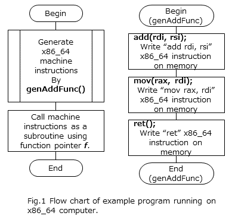
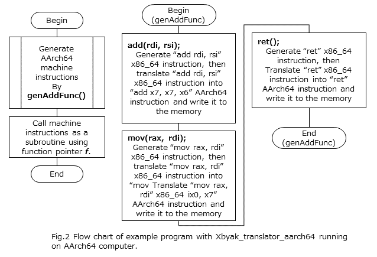

# Due to our company's internal policy issues, this repository may be closed for one month starting March 1. We plan to reopen it on April 1, though delays are possible. Upon reopening, the repository URL will be github.com/FujitsuResearch/xbyak_aarch64. We apologize for any inconvenience this may cause.

# Xbyak_translator_aarch64

## Abstract

Xbyak_translator_aarch64 is being developed to run x86_64 applications using Xbyak, Just-In-Time assembler for x86_64 computers, on AArch64 ones.
By compiling those applications with Xbyak_translator_aarch64, you can run them on AArch64 with the speed benefits of Just-In-Time assembler. In particular, Xbyak_translator_aarch64 is being developed for porting oneDNN (formerly known as DNNL;Deep Neural Network Library) to AArch64. 


## Example

```
/* Example code 1 */
#include "xbyak.h"
using namespace Xbyak;
class Generator : public CodeGenerator {
public:
  void genAddFunc() {
    add(rdi, rsi);
    mov(rax, rdi);
    ret();
  }
  const uint8_t *gen() {
    genAddFunc();
    ready();
    return getCode();
  }
};
int main() {
  Generator gen;
  int (*f)(int a, int b) = (int (*)(int a, int b))gen.gen();
  std::cout << f(3,4) << std::endl;
  return 0;
}
```

If Example code 1 is compiled with Xbyak, and run on an x86_64 computer, 
its flow chart becomes as Fig. 1.

 

As the calling convention of GCC for x86_64, 
the first and second arguments of function call are passed by rdi and rsi registers, 
and return value is passed by rax register. 
Therefore, this example output "7" on std::cout.

```
/* Example code 2 */
#include <xbyak_translator_aarch64/xbyak.h>

class Code : public Xbyak::CodeGenerator {
public:
  Code() {
    genAbiWrapping();
    add(rdi, rsi);
    mov(rax, rdi);
    ret();
  }
  void genAbiWrapping() {
    /*
      This is the function generating AArch64 mov instruction implemented by
      Xbyak_aarch64.
    */
    xa_->mov(x7, x0);
    xa_->mov(x6, x1);
  }
};

int main() {
  Code c;
  c.ready();
  auto f = c.getCode<int (*)(int, int)>();
  std::cout << f(3, 4) << std::endl;
}
```

If Example code 2 is compiled with Xbyak_aarch64 and Xbyak_translator_aarch64,
and run on AArch64 computer 
its flow chart becomes as Fig. 2.

 

Although "genAbiWrapping()", omitted in Fig. 2, is added in order to absorb the difference of calling convention between AArch64 and x86_64,
Example code 2 is almost the same as Example code 1. (Imagine a case where a complicated code  is written in "genAddFunc()" with Xbyak!)
Therefore, Xbyak_translator_aarch64 can simplify porting x86_64 applications with Xbyak to AArch64.

**Note**:
As the calling convention of AArch64, the first and second arguments of function call is passed by x0 and x1 registers, and return value is passed by x0 register. Register indexes of rax, rsi and rdi in Xbyak are zero, six and seven, respectively.

## x86_64 instructions supported by Xbyak_translator_aarch64

Currently, Xbyak_translator_aarch64 can translate x86_64 instructions generated by Xbyak in DNNL v0.21.2. 
We have plans to add support for the necessary x86_64 instructions to run a major version of DNNL.

## Limitation

Due to the architectural difference between x86_64 and AArch64, there are cases where Xbyak_translator_aarch64 alone cannot provide a complete translation. In those cases, the differences can be deal with by directly rewriting the relevant parts of source code using Xbyak_aarch64.

### Conditional branch instructions

Currently, there is no support for conditional branch instructions with parity flag.

### Flag affecting instructions

While almost all of scalar instructions in x86_64 modify the state flag, the most of scalar instructions in AArch64 does not affect the state flag.
Please insert "cmp" instruction explicitly, before conditional branch instructions.

### Mask-register related instructions

Because the size of predicate registers for Armv8-A SVE is depend on implementation of hardware vendors, 
there is no support for translation of instructions manipulating mask registers such as kmovb/w/q/d and ktestb/w/d/q.
Please rewrite those code lines by Xbyak_aarch64 functions.

## Tested environment

|Hardware|CPU|OS|Compiler|
|----|----|----|----|
|Fujitsu PRIMEHPC FX700|A64FX|CentOS Liniux Version 8|g++ (GCC) 8.3.1|

You may try Xbyak_translator_aarch64 on QEMU (generic and open source machine emulator and virtualizer).
We recommend using QEMU version 5.0.0 or higher, if you ports applications which use AVX2/AVX512 instructions by Xbyak.

## M1 mac
Make symbolic links to link `libxed.dylib`.
```
cd sample
ln -s ../translator/third_party/build_xed_aarch64/kits/xed/lib obj
cd ../translator/tests/
ln -s ../third_party/build_xed_aarch64/kits/xed/lib obj
```

## Build instructions
Please refer [build.md](build.md)

## Reference

- Chapter C6:A64 Base Instruction Descriptions and C7:A64 Advanced SIMD and Floating-point Instruction Descriptions of "ARM(R) Architecture Reference Manual ARMv8, for ARMv8-A architecture profile", ARM DDI 0487D.b (ID042519)".
- "ARM(R) Architecture Reference Manual Supplement, The Scalable Vector Extension (SVE), for ARMv8-A", ARM DDI0584.
- "Procedure Call Standard for the ARM 64-bit Architecture (AArch64)",  ARM IHI 0055B".
- "Intel(R) 64 and IA-32 Architectures Software Developer's Manual Volume 2 (2A, 2B, 2C & 2D):Instruction Set Reference, A-Z", October 2019.
- Xbyak [https://github.com/herumi/xbyak](https://github.com/herumi/xbyak)
- Xbyak_aarch64 [https://github.com/fujitsu/xbyak_aarch64](https://github.com/fujitsu/xbyak_aarch64)
- DNNL_aarch64 [https://github.com/fujitsu/dnnl_aarch64](https://github.com/fujitsu/dnnl_aarch64)
- [Xbyak_aarch64; Just-In-Time Assembler for Armv8-A and Scalable Vector Extension](https://connect.linaro.org/resources/lvc21/lvc21-203/)
- [Development of Deep Learning Library for AArch64 CPU](https://connect.linaro.org/resources/lvc21f/lvc21f-212/)
- [A Binary Translator to Accelerate Development of Deep Learning Processing Library for AArch64 CPU](https://search.ieice.org/bin/pdf_advpub.php?category=C&lang=E&fname=2021LHP0001&abst=)


## License

Copyright FUJITSU LIMITED 2020

Licensed under the Apache License, Version 2.0 (the "License");
you may not use this file except in compliance with the License.
You may obtain a copy of the License at

    http://www.apache.org/licenses/LICENSE-2.0

Unless required by applicable law or agreed to in writing, software
distributed under the License is distributed on an "AS IS" BASIS,
WITHOUT WARRANTIES OR CONDITIONS OF ANY KIND, either express or implied.
See the License for the specific language governing permissions and
limitations under the License.

## Acknowledgement

We would like to thank Mitsunari-san (Cybozu Labs, Inc.) for disclosing his Xbyak and for giving us useful advice on development of Xbyak_translator_aarch64.


## History

|Date|Version|Remarks|
|----|----|----|
|May 29, 2020|0.9.0|First public release version.|


## Copyright

Copyright FUJITSU LIMITED 2020
